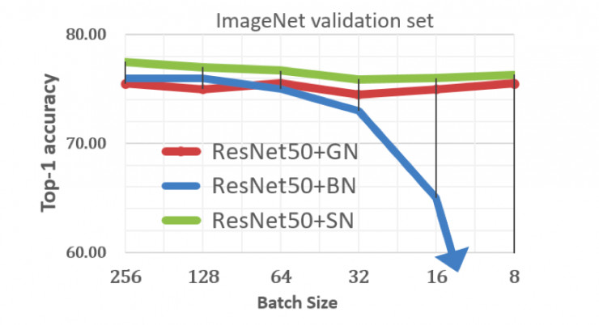

从上图可以看到，其实各个方式只是在不同维度、粒度上进行变化。假设输入的shape为(N, C, H*W)，则有：

* Batch Norm：在N维度做normalization，计算$N*H*W$维度的均值与标准差(这里包括图片有点让人误解，其实在H、W上是分别做的，并没有混在一起算均值、方差)
* Layer Norm：在C维度做normalization，计算$C*H*W$维度的均值与标准差
* Instance Norm：计算每一个$H*W$的均值与标准差
* Group Norm：在G维度做normalization，计算$(C//G)*H*W$维度的均值与标准差，其实GN是LN与IN的折中方法。
  
自适应归一化SN(Switchable Norm)如下：

效果图如下：
